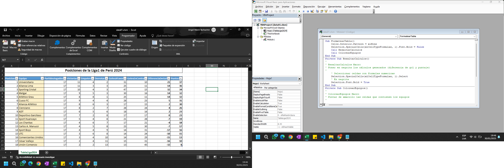
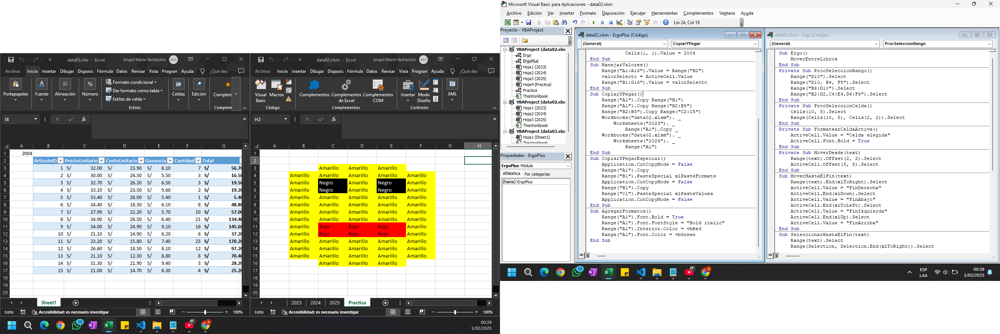
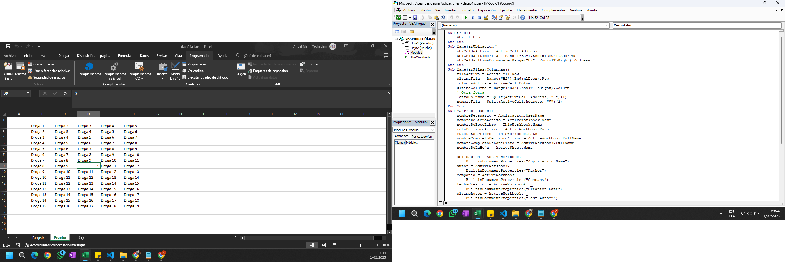

### Gestión de Macros
    ✅ Introducción al Panel de VBA
    ✅ Grabación, Guardado, Reubicación y Depuración de Macros
    ✅ Simplificación de código de Macros
    ✅ Combinar y Ocultar subprocesos

### Programación Básica en VBA de Excel - Parte 1
    ✅ Objetos RANGE, CELLS y ACTIVECLL
    ✅ Propiedades OFFSET, END, RANGO, CURRENTREGION y VALUE
    ✅ Navegación entre Celdas, Hojas y Libros
    ✅ Copiado y Pegado desde VBA

### Programación Básica en VBA de Excel - Parte 2
    ✅ Propiedades ADDRERS, ROW, COLUMN y SPLIT para ubicaciones
    ✅ BuiltinDocumentProperties para extraer información del libro 
    ✅ Abrir y Cerrar Libros automáticamente
