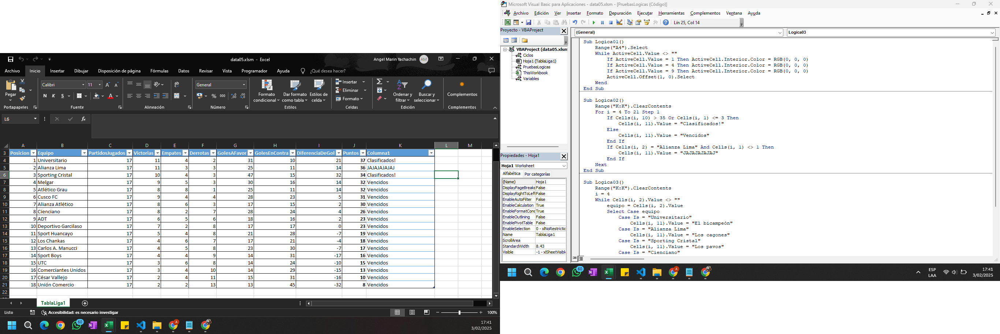
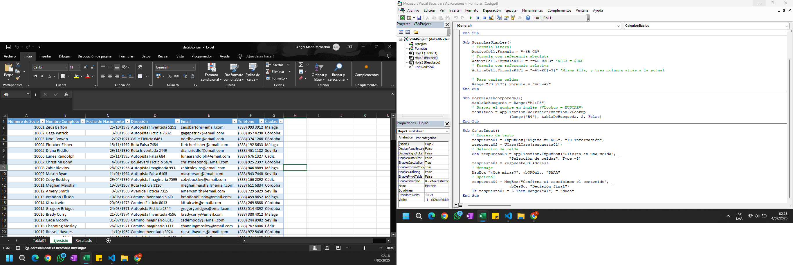
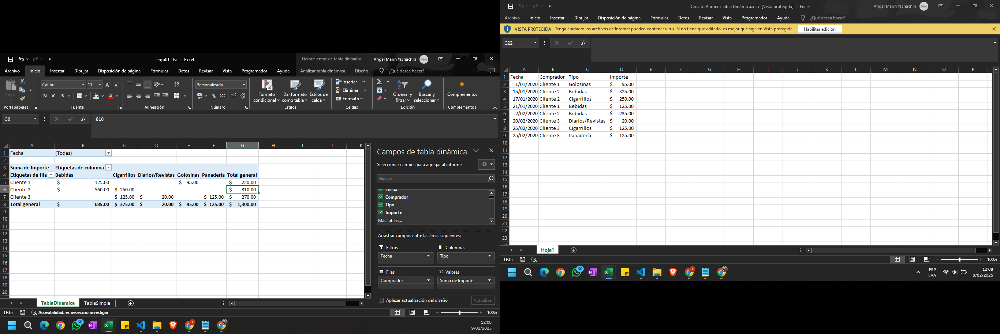
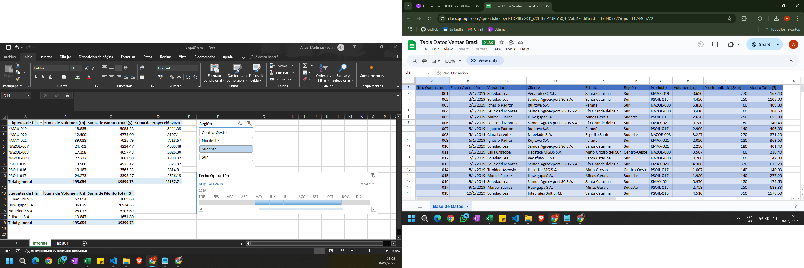
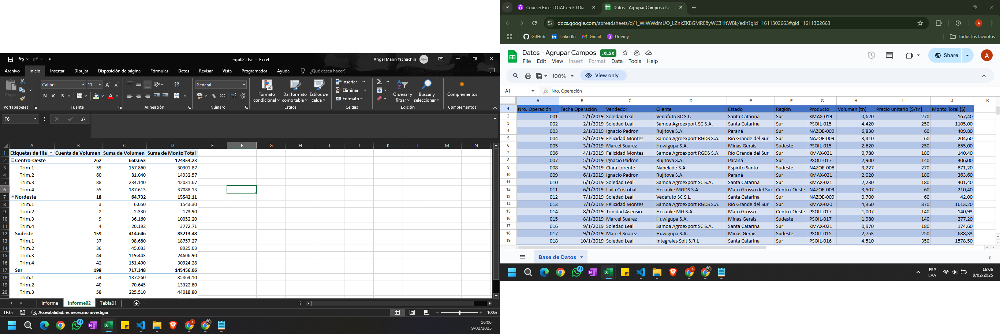
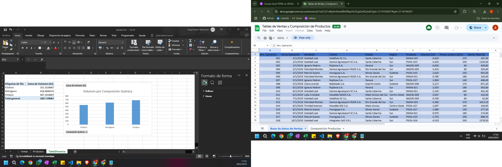
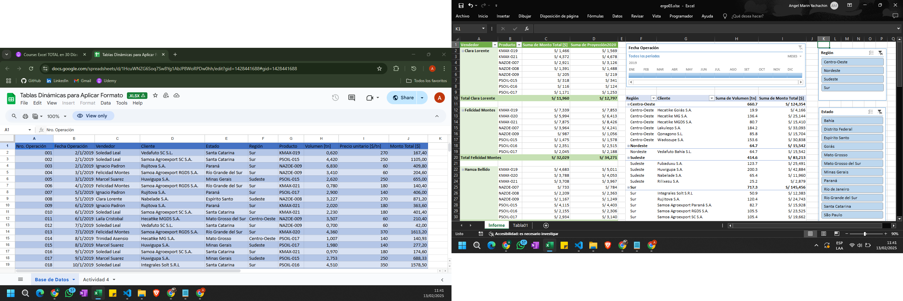

## EXCEL AVANZADO

### Gestión de Macros
    ✅ Introducción al Panel de VBA
    ✅ Grabación, Guardado, Reubicación y Depuración de Macros
    ✅ Simplificación de código de Macros
    ✅ Combinar y Ocultar subprocesos

### Programación Básica en VBA de Excel - Parte 1
    ✅ Objetos RANGE, CELLS y ACTIVECLL
    ✅ Propiedades OFFSET, END, RANGO, CURRENTREGION y VALUE
    ✅ Navegación entre Celdas, Hojas y Libros
    ✅ Copiado y Pegado desde VBA

### Programación Básica en VBA de Excel - Parte 2
    ✅ Propiedades ADDRESS, ROW, COLUMN y SPLIT para ubicaciones
    ✅ BuiltinDocumentProperties para extraer información del libro 
    ✅ Abrir y Cerrar Libros automáticamente

### Caja de Herramientas del Programador - Parte 1
    ✅ Variables locales, a nivel de módulo y a nivel de proyecto
    ✅ Ciclos DO LOOP, FOR NEXT y WHILE WEND
    ✅ Pruebas lógicas IF THEN ELSE y SELECT CASE

### Caja de Herramientas del Programador - Parte 2
    ✅ Uso de Fórmulas desde VBA
    ✅ Cajas de texto INPUTBOX y MSGBOX
    ✅ Arreglos unidimensional, bidimensionales, estáticos y dinámicos

## EXCEL - TABLAS DINÁMICAS

### Tablas Dinámicas - Introducción
    ✅ Crear Tabla de Valores
    ✅ Área de Valores, Filas, Columnas y Filtros

### Tablas Dinámicas - Herramientas Útiles
    ✅ Segmentación de Datos y Escala de Tiempo
    ✅ Actualizar Tablas y Gráficos automáticamente
    ✅ Campos calculados y Subtotales

### Tablas Dinámicas - Agrupar Campos
    ✅ Agrupar Campos de Texto y Campos Numéricos
    ✅ Agrupar Campos de Fecha y Hora

### Tablas Dinámicas - Trabajar con Múltiples Orígenes
    ✅ Conexión de 2 o más Tablas
    ✅ Importar Datos de Otro Libro y de una BD de Access

### Tablas Dinámicas - Formatos y Opciones
    ✅ Mostrar Registros sin Datos y en Celdas Vacías
    ✅ Formato de Celdas
    ✅ Diseño de Informe

